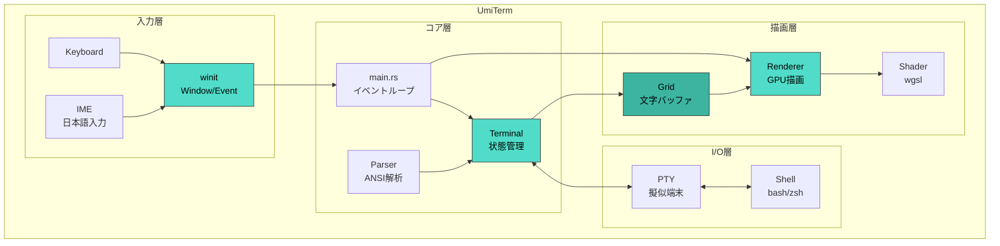
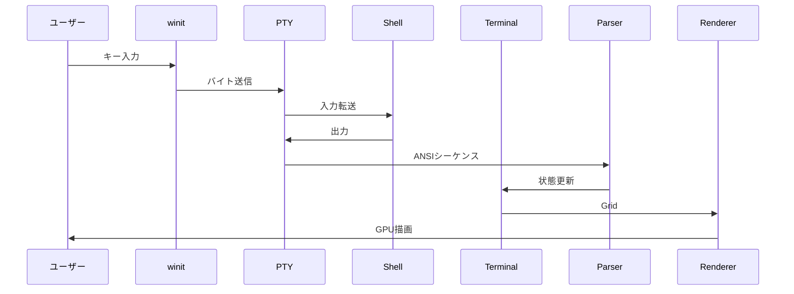

# UmiTerm 🌊

  

Rust製GPU加速ターミナルエミュレータ


## インストール

### Homebrew（推奨）
```bash
brew tap ryutoyoda/tap
brew install --cask umiterm
```

### 手動インストール
1. [Releases](https://github.com/RyutoYoda/UmiTerm/releases) から `UmiTerm-v*.zip` をダウンロード
2. 解凍して `UmiTerm.app` を `/Applications` にドラッグ
3. 初回起動時は右クリック →「開く」を選択

## アーキテクチャ



## データフロー



## 各モジュールの役割

| モジュール | 役割 | 主な機能 |
|-----------|------|----------|
| `main.rs` | エントリーポイント | winitウィンドウ、イベントループ、IME処理 |
| `pty.rs` | 擬似端末 | シェル通信、ノンブロッキングI/O |
| `terminal.rs` | ターミナル状態 | カーソル、スクロール、スタイル管理 |
| `grid.rs` | 文字バッファ | 2Dセル配列、ダーティフラグ |
| `parser.rs` | ANSIパーサー | CSI/OSC/SGRシーケンス解析 |
| `renderer.rs` | GPUレンダラー | wgpu描画、グリフキャッシュ |
| `shader.wgsl` | シェーダー | 背景・テキスト描画 |

## ビルド・実行

```bash
# 開発版
cargo run

# リリース版（最適化済み）
cargo run --release

# カスタムフォント
UMITERM_FONT=/path/to/font.ttf cargo run --release
```

## 依存クレート

| クレート | 用途 |
|---------|------|
| wgpu | GPU描画 |
| winit | ウィンドウ管理 |
| portable-pty | 擬似端末 |
| vte | ANSIパーサー |
| fontdue | フォントラスタライズ |
| crossbeam-channel | スレッド間通信 |
| parking_lot | 高速ロック |
| unicode-width | 全角文字幅計算 |

## 対応機能

- [x] 基本的な文字表示
- [x] 256色/TrueColor
- [x] カーソル移動・形状変更
- [x] スクロール
- [x] 代替スクリーン（vim対応）
- [x] 太字/斜体/下線
- [x] 日本語入力（IME対応）
- [x] 全角文字表示
