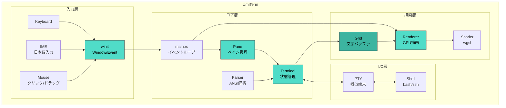
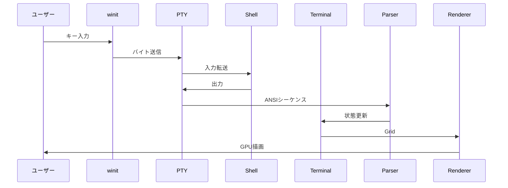

# UmiTerm 🌊

  

Rust製GPU加速ターミナルエミュレータ

**[ベンチマーク結果](BENCHMARK.md)** - Alacrittyと同クラスの性能、バイナリサイズ1/3


## インストール

### Homebrew（推奨）
```bash
brew tap ryutoyoda/tap
brew install --cask umiterm
```

### 手動インストール
1. [Releases](https://github.com/RyutoYoda/UmiTerm/releases) から `UmiTerm-v*.zip` をダウンロード
2. 解凍して `UmiTerm.app` を `/Applications` にドラッグ
3. 初回起動時は右クリック →「開く」を選択

## アーキテクチャ

```
┌─────────────────────────────────────────────────────────────┐
│                         UmiTerm                             │
├─────────────────────────────────────────────────────────────┤
│  App                                                        │
│  └─ windows: HashMap<WindowId, WindowState>                 │
│       └─ WindowState                                        │
│            ├─ window: Arc<Window>     (winit)               │
│            ├─ renderer: Renderer      (wgpu GPU描画)        │
│            ├─ layout: PaneLayout      (分割レイアウト)       │
│            └─ panes: HashMap<PaneId, Pane>                  │
│                 └─ Pane                                     │
│                      ├─ terminal: Terminal (状態管理)        │
│                      ├─ parser: AnsiParser (ANSI解析)       │
│                      └─ pty: Pty           (擬似端末)        │
└─────────────────────────────────────────────────────────────┘
```



## データフロー



## 各モジュールの役割

| モジュール | 役割 | 主な機能 |
|-----------|------|----------|
| `main.rs` | エントリーポイント | winitウィンドウ、イベントループ、IME処理、マウス処理 |
| `pane.rs` | ペイン管理 | 画面分割、レイアウト、境界線ドラッグ |
| `pty.rs` | 擬似端末 | シェル通信、ノンブロッキングI/O |
| `terminal.rs` | ターミナル状態 | カーソル、スクロール、スタイル管理 |
| `grid.rs` | 文字バッファ | 2Dセル配列、ダーティフラグ |
| `parser.rs` | ANSIパーサー | CSI/OSC/SGRシーケンス解析 |
| `renderer.rs` | GPUレンダラー | wgpu描画、グリフキャッシュ、ペイン描画 |
| `shader.wgsl` | シェーダー | 背景・テキスト描画 |

## ビルド・実行

```bash
# 開発版
cargo run

# リリース版（最適化済み）
cargo run --release

# カスタムフォント
UMITERM_FONT=/path/to/font.ttf cargo run --release
```

## 依存クレート

| クレート | 用途 |
|---------|------|
| wgpu | GPU描画 |
| winit | ウィンドウ管理 |
| portable-pty | 擬似端末 |
| vte | ANSIパーサー |
| fontdue | フォントラスタライズ |
| crossbeam-channel | スレッド間通信 |
| parking_lot | 高速ロック |
| unicode-width | 全角文字幅計算 |

## キーバインド

### ウィンドウ操作

| キー | 機能 |
|------|------|
| `Cmd + N` | 新規ウィンドウを開く |
| `Cmd + W` | 現在のペインを閉じる（最後の1つならウィンドウを閉じる） |

### ペイン操作（画面分割）

| キー | 機能 |
|------|------|
| `Cmd + D` | 縦分割（左右に分割） |
| `Cmd + Shift + D` | 横分割（上下に分割） |
| `Cmd + ]` | 次のペインにフォーカス移動 |
| `Cmd + [` | 前のペインにフォーカス移動 |

### マウス操作

| 操作 | 機能 |
|------|------|
| **クリック** | クリックしたペインにフォーカスを切り替え |
| **ドラッグ** | 境界線をドラッグしてペインサイズを調整 |

※ 境界線にマウスを合わせるとカーソルがリサイズカーソル（↔ / ↕）に変わります

### ターミナル操作

| キー | 機能 |
|------|------|
| `Ctrl + C` | 実行中のプロセスを中断 |
| `Ctrl + D` | EOF（シェル終了） |
| `Ctrl + Z` | プロセスを一時停止 |
| `Ctrl + L` | 画面クリア |
| `Ctrl + A` | 行頭へ移動 |
| `Ctrl + E` | 行末へ移動 |
| `Ctrl + U` | カーソルより前を削除 |
| `Ctrl + K` | カーソルより後を削除 |
| `Ctrl + W` | 単語を削除 |
| `Ctrl + R` | 履歴検索 |

## 対応機能

- [x] 基本的な文字表示
- [x] 256色/TrueColor
- [x] カーソル移動・形状変更
- [x] スクロール
- [x] 代替スクリーン（vim対応）
- [x] 太字/斜体/下線
- [x] 日本語入力（IME対応）
- [x] 全角文字表示
- [x] マルチウィンドウ
- [x] 画面分割（ペイン）
- [x] マウスでペイン切り替え
- [x] ドラッグでペインサイズ調整
